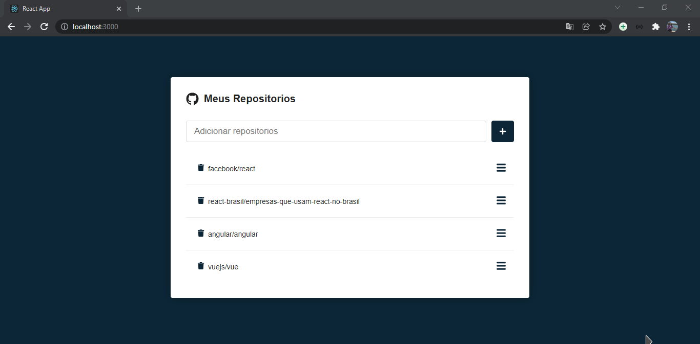
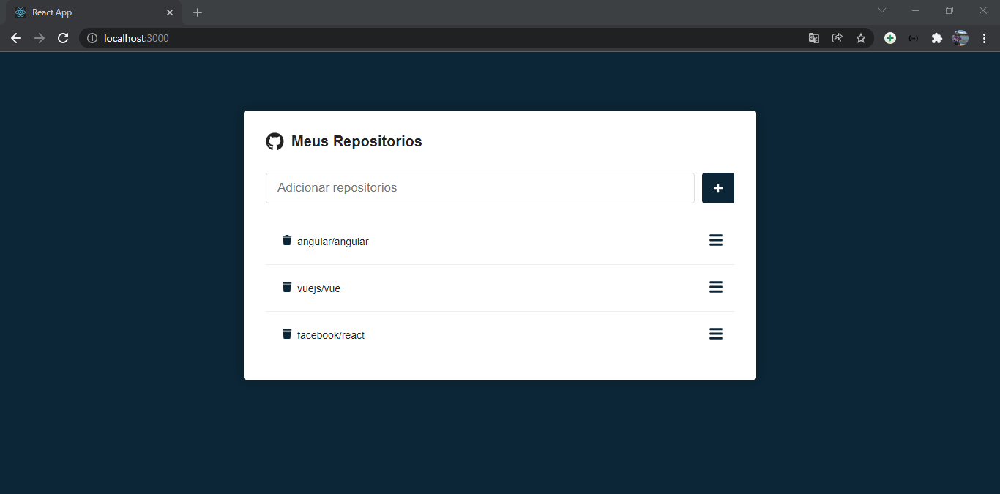
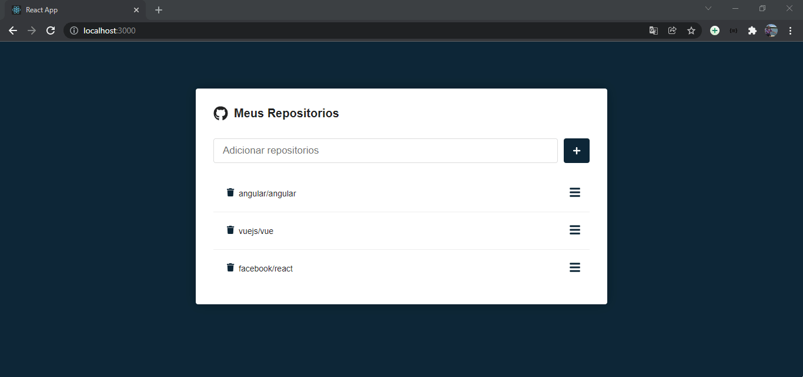

## [REACT.JS] GIT FAVORITES </h2>

[PT-BR]💻 Gerenciador de repositorios publicos, onde você pode adicionar ou remover de acordo com sua preferência, sendo assim, acompanhando com mais facilidade

<h3>🚀 Tecnologias utilizadas </h3>
<ul>
  <li> React.js </li>
</ul>

[ ENG ]💻 Public repository manager, where you can add or remove as you prefer, making it easy to follow up

<h3>🚀 Technologies used </h3>
<ul>
  <li> React.js </li>
</ul>

👨‍💻 Preview: 

